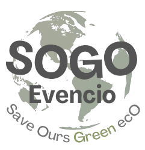

# SOGO IVENCIO

## 

## RUN DEVELOPMENT

```bash
git clone https://github.com/nurhudajoantama/sogo-evencio
cd sogo-evencio
composer install
```

duplikat file .env.example menjadi .env

```bash
cp .env.example .env
```

isi file `.env` sesuai dengan konfigurasi anda

-   database
-   raja ongkir api key

```bash
php artisan key:generate
php artisan storage:link
php artisan migrate --seed
```

lalu jalankan development server

```bash
php artisan serve
```
